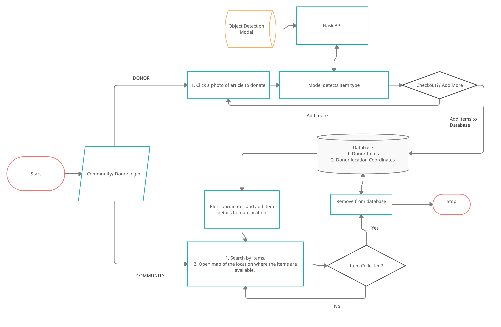
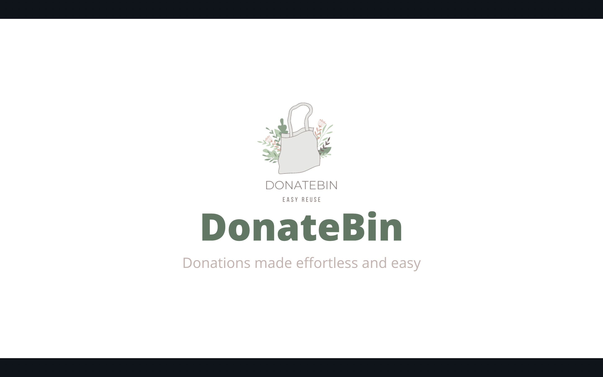
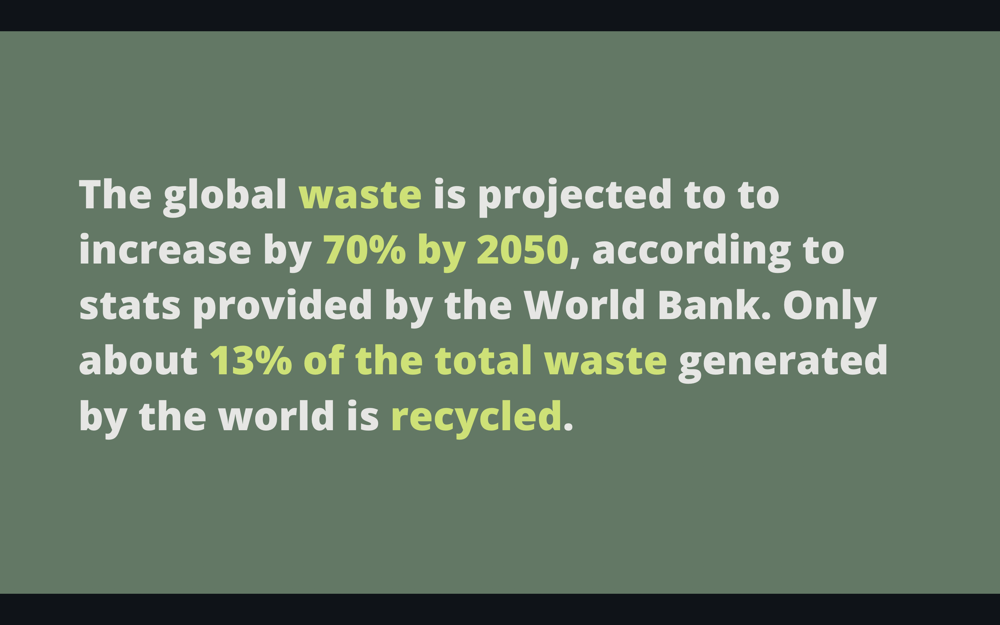
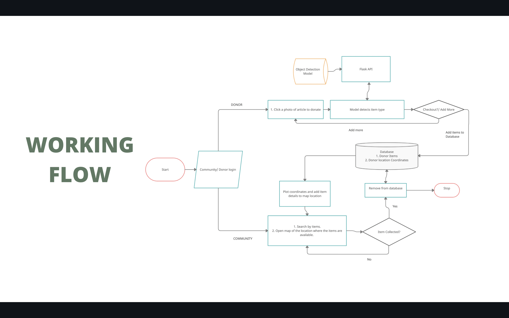
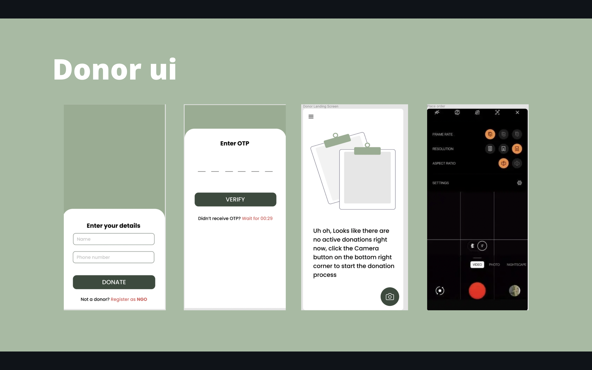
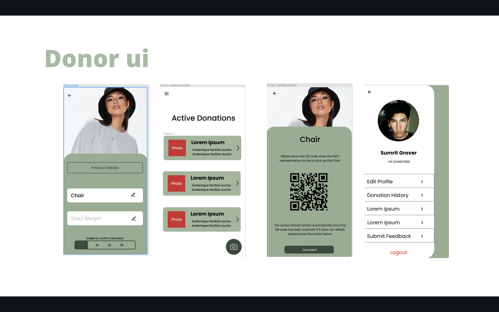
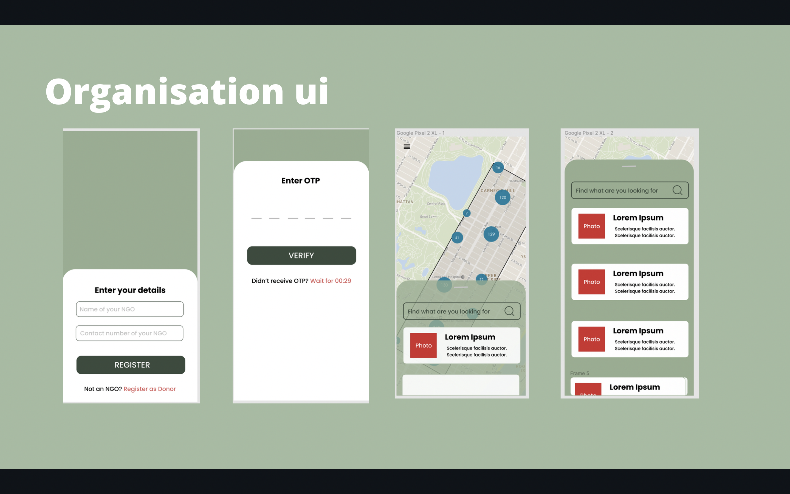
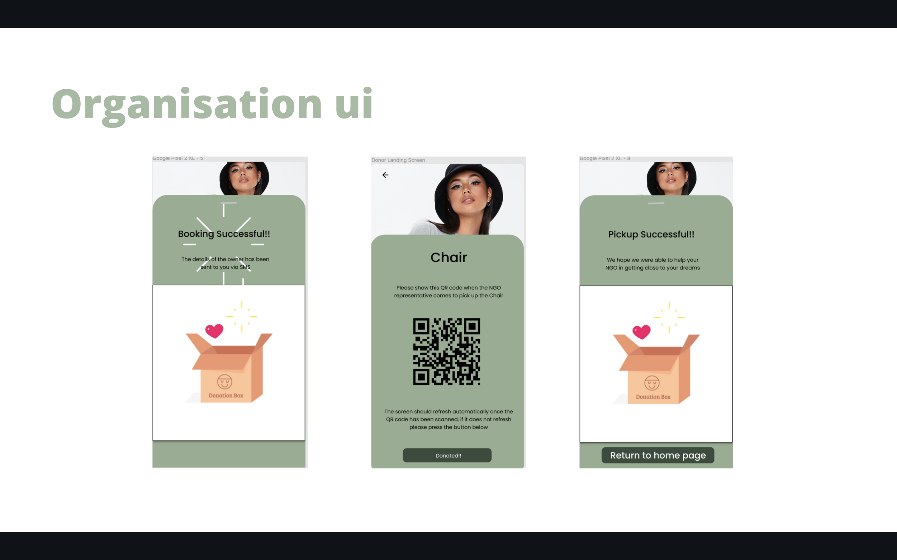
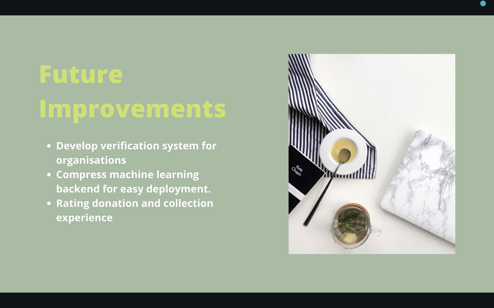

# DonateBin - DonateBin is an app that efficiently connects donors with non profit organisations.

## Inspiration
The global waste is projected to to increase by 70% by 2050, according to stats provided by the World Bank. Only about 13% of the total waste generated by the world is recycled. A lot of old _clothes_, _furniture items_, _stationary items_ thrown away by us can be _reused_ by others, but they end up in waste bins because we do not like to take the extra effort in looking up and contacting different non profit organisations and waiting for them to collect the items.  
Our application **connects donors to non profit organisations**, such that, **donation experience** for the donors is **easy and effortless** and the item **collection** for organisations is **systematic and efficient**. 
## What it does

The application has **two interfaces**, one for the donors and one for organisations.  The **donor** can sign up and log into their account as a donor. Then they can click a picture of the item they want to donate and proceed to checkout. They can click pictures of multiple items they want to donate before finally checking out. The item description is predicted by a machine learning algorithm in the backend so that the person doesn't have to spend time entering specific details. The item picture, description and the donor location are stored in our database. Now the donor has to wait until an organisation comes and picks up the items at their door step. Thus the donor is free of the hassle of looking up and calling different organisations and enquire about their collection details.  The **organisation** can signup or log into the app as an organisation. The app home page has a map, highlighting the locations of donors with different collectible items in whichever area they want to collect from. The organisation can click on any highlighted location and scan through the items available there. Thus the organisation can scan through all the items available in an area and fix a day to collect items they need from every location in that area. 
Hence the donors can donate any item in any quantity (without worrying about how less or how much there donation is going to be) and organisations can collect items from entire area in one day without having to make rounds or making different appointment with people. 
## App UI

 
## How we built it
Our development application is visual studio code.
Stack: 
<ul>
<li> Front-End - React Native </li>
<li>Back-End - Flask, PyTorch </li>
<li> Database - MongoDB </li>
</ul>

## Challenges we ran into
<ul>
<li> Data collection of different fashion items was a challenge.</li>
<li> Transfer learning on VGG-16 for fashion items and furniture items was time consuming.</li>
</ul>

## Accomplishments that we're proud of
We are proud to have built an application that contributes towards easy sustainability and reducing waste generation, at the same time creating an opportunity to help someone with a chance to live a better life.
## What we learned
While developing the application, we learnt many new things such as:
<ul>
<li> Integrating a map in an application </li>
<li> Transfer learning on VGG 16. </li>
</ul>

## What's next for DonateBin

We want to set up a verification method for organisations. We also want to set up a rating system for donors and organisations, to ensure good quality items are being donated and donation happens ethically. We want to reduce the size of the machine learning backend so that it can be deployed easily. 

<h1 align="center"> Contributors </h1>
<table align="center">
<tr align="center">
<td>
<strong>Shubhra Agarwal</strong>

</td>
<td>
<strong>Sumrit Grover</strong>

</td>
<td>
<strong>Breenda Das</strong>

</td>
</tr>
</table>

